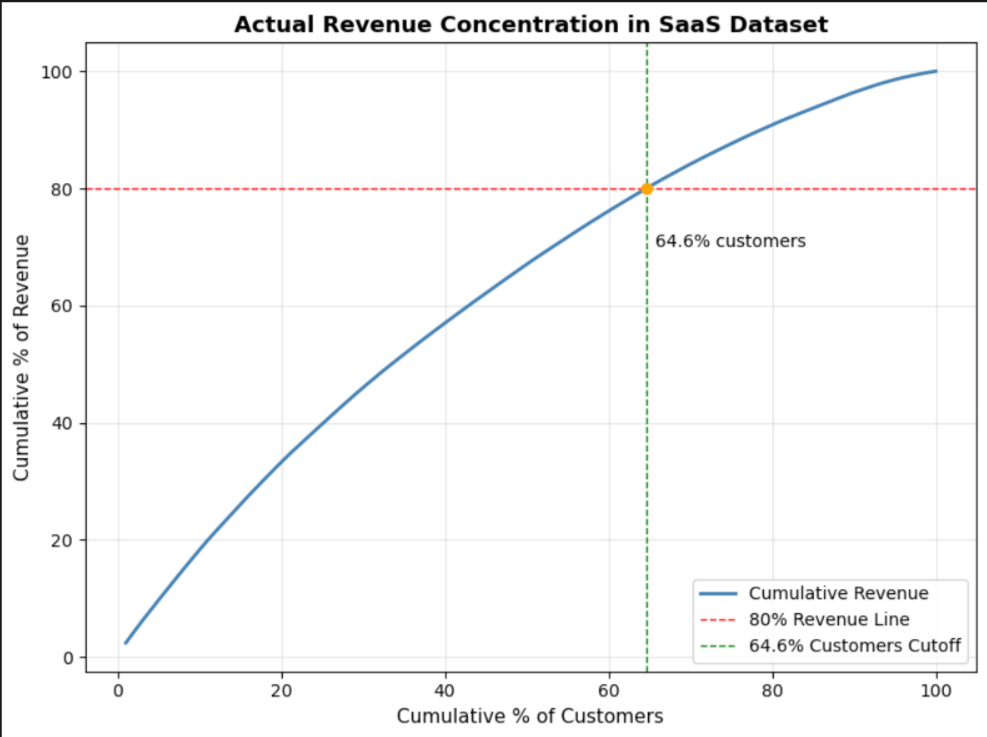
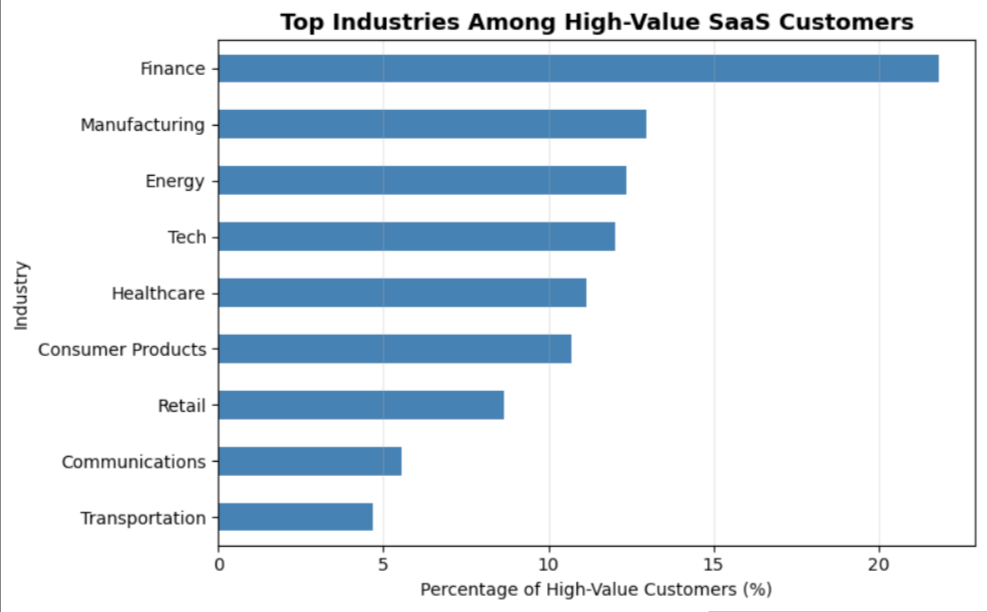
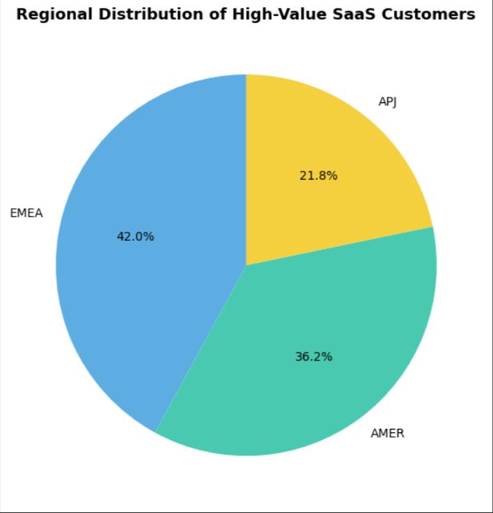

# SaaS Revenue Concentration Analysis (Pareto 80/20)

## Overview
This project analyzes revenue concentration in a SaaS sales dataset to determine how much revenue is generated by the top percentage of customers. The study uses Pareto (80/20) principles to assess revenue dependency and identify high-value customer segments.

## Objectives
- Quantify the share of revenue contributed by top customers.
- Visualize cumulative revenue vs. customer distribution.
- Identify high-value industries and regions driving SaaS growth.

## Dataset
Source: [AWS SaaS Sales Dataset on Kaggle](https://www.kaggle.com/datasets/nnthanh101/aws-saas-sales)  
Columns used:
- `Customer ID`
- `Industry`
- `Region`
- `Revenue (Sales)`

## Methodology
1. Data cleaning and preparation with **Pandas**.
2. Aggregation of total revenue per customer.
3. Calculation of cumulative revenue and customer percentages.
4. Pareto visualization to identify actual revenue concentration.
5. Profiling of top-revenue customers by **Industry** and **Region**.

## Key Findings
- Top **64.6%** of customers generate **80%** of total revenue.
- Highest-value industries: **Finance**, **Manufacturing**, **Energy**, **Tech**, **Healthcare**.
- Top regions: **EMEA (42%)**, **AMER (36%)**, **APJ (22%)**.
- The SaaS portfolio shows **broad revenue distribution** — stable but less dependent on few large clients.

## Visuals
| Pareto Curve | Industry Distribution | Regional Breakdown |
|---------------|----------------------|--------------------|
|  |  |  |

## Tools Used
- **Python** (Pandas, NumPy, Matplotlib)
- **Jupyter Notebook**
- **Kaggle** dataset integration

## How to Reproduce
```bash
git clone https://github.com/<your-username>/saas-revenue-pareto-analysis.git
cd saas-revenue-pareto-analysis
pip install -r re
